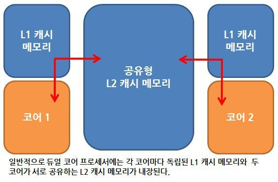
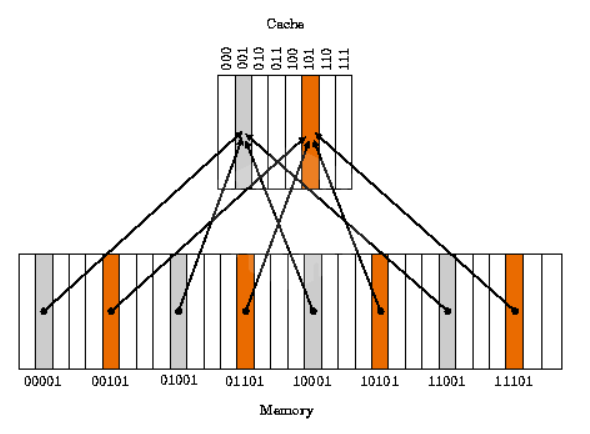

## 캐시 메모리 (Cashe Memory)

> **속도가 빠른 장치와 느린 장치에서 속도 차이에 따른 병목 현상을 줄이기 위한 메모리**

</br>
</br>

CPU가 주기억장치에서 저장된 데이터를 읽어올 때, 자주 사용하는 데이터를 캐시 메모리에 저장한 뒤, 다음에 이용할 때 주기억장치가 아닌 캐시 메모리에서 먼저 가져옴으로써 속도를 향상 시킨다. </br>

</br>

메인 메모리와 CPU 사이에 위치하며, CPU의 속도에 버금갈 만큼 메모리 계층에서 가장 속도가 빠르지만, 용량이 적고 비싸다는 단점도 있다. </br>

</br>

하나의 CPU에는 이러한 캐시 메모리가 2~3개 사용된다.(L1, L2, L3) </br>
이는 속도와 크기에 따라 분류한 것으로, 일반적으로 L1 캐시부터 먼저 사용된다. </br>

</br>

### 듀얼 코어 프로세서의 캐시 메모리

> 각 코어마다 독립된 L1 캐시 메모리를 가지고, 두 코어가 공유하는 L2 캐시 메모리가 내장된다. </br>
</br>



</br>
</br>

L1 캐시는 보통 8~64KB 정도의 용량으로 CPU가 가장 빠르게 접근하게 되며, 여기서 데이터를 찾지 못하면, L2 캐시 메모리로 넘어간다. </br>

</br>

L2 캐시 메모리는 용도와 역할은 L1 캐시와 비슷하지만 속도는 L1보다 느리다. </br>
일반적으로 64KB ~ 4MB 정도가 사용된다. </br>

</br>
</br>

- L1 : CPU 내부에 존재 </br>
- L2 : CPU와 RAM 사이에 존재 </br>
- L3 : 보통 메인보드에 존재 </br>

</br>
</br>

### 디스크 캐시

> 주기억장치(RAM)와 보조기억장치(하드디스크) 사이에 존재하는 캐시 </br>

</br>
</br>

디스크 캐시는 **디스크로부터 읽은 내용을 일부 보존해두는 메모리 영역**을 말한다. 따라서 나중에 같은 데이터를 읽어야 할 경우 실제 디스크에서 읽는 것이 아니라 디스크 캐시에서 빠르게 읽어낼 수 있다. </br>

</br>

이는 **메모리에서 읽는 속도가 디스크에서 읽는 속도보다 빠르기 때문**이다.

</br>
</br>
</br>

## 캐시 메모리 작동 원리

> **캐시의 지역성(Cache Locality)**란? </br>
> </br>
> - 데이터에 대한 접근이 시간적 혹은 공간적으로 가깝게 발생하는 것을 말한다. </br>
> - 캐시의 **적중률(Hit rate)**을 극대화하여 캐시가 효율적으로 동작하기 위해 사용되는 성질이다. </br>

</br>

### 시간 지역성 (Temporal Locality)

* 최근에 사용했던 데이터가 재참조될 가능성이 높은 특성

> for, while과 같은 반복문에 사용되는 조건 변수처럼 한번 참조된 데이터는 잠시후 또 참조될 가능성이 높다.

</br>
</br>

### 공간 지역성 (Spatial Locality)

* 최근에 사용했던 데이터와 인접한 데이터가 참조될 가능성이 높다는 특성

> A[0], A[1]과 같은 연속 접근 시, 참조된 데이터 근처에 있는 데이터가 잠시후 또 참조될 가능성이 높다.

</br>
</br>
</br>

## 캐시 미스 (Cache Miss)

* CPU가 요청한 데이터가 캐시에 있으면 **Cache Hit**, 없어서 DRAM에서 가져오면 **Cache Miss**

</br>

1. Cold miss

> 해당 메모리 주소를 처음 불러서 나는 미스 </br>
</br>

2. Conflict miss

> 캐시 메모리에 A와 B 데이터를 저장해야 하는데, A와 B가 같은 캐시 메모리 주소에 할당되어 있어서 나는 미스 (direct mapped cache에서 많이 발생) </br>

</br>

3. Capacity miss

> 캐시 메모리의 공간이 부족해서 나는 미스 

</br>
</br>

## 구조 및 작동 방식

캐시 메모리는 메인 메모리에 비해 크기가 매우 작기 때문에 메인 메모리와 1:1 매칭이 불가능하다. </br>

</br>

캐시가 아무리 CPU에 가깝게 위치하더라도, 데이터가 캐시 내의 어느 곳에 저장되어 있는지 찾기가 어려워 모든 데이터를 순환한다면 캐시의 존재 가치가 없어지므로 *캐시 내의 데이터가 저장되어 있는 위치를 쉽게 찾을 수 있는 구조가 필요*하다. </br>

</br>

따라서 캐시에 데이터를 저장할 때 특정 자료구조를 사용해 묶음으로 저장하는데, 이를 **캐싱 라인(Caching Line)**이라고 한다.

</br>
</br>

캐싱 라인의 매핑 방법은 다음과 같이 3가지로 구분될 수 있다.


### Direct Mapped Cache



</br>

* 직접 매핑으로, **메인 메모리를 일정한 크기의 블록으로 나누어 각각의 블록을 캐시의 정해진 위치에 매핑하는 방식**

> 가장 간단하고 빠르고 구현도 쉽다. </br>
> Conflict Miss 가 발생한다는 단점도 있다. </br>

</br>

### Fully Associative Cache

* 캐시 메모리의 **빈 공간에 마음대로 주소를 저장하는 방식**

> 저장하는 것은 간단하지만, 원하는 데이터가 있는지 찾기 위해서는 모든 태그를 병렬적으로 검사해야 하기 때문에 복잡하고 비용이 높다는 단점이 있다.

</br>
</br>

### Set Associate Cache

* Direct Mapping + Fully Associative Mapping
* 특정 행을 지정하고, 그 행안의 어떤 열이든 비어있을 때 저장하는 방식

> Direct에 비해 검색 속도는 느리지만, 저장이 빠르고 Fully에 비해 저장이 느린 대신 검색이 빠르다.

</br>
</br>

```toc
```