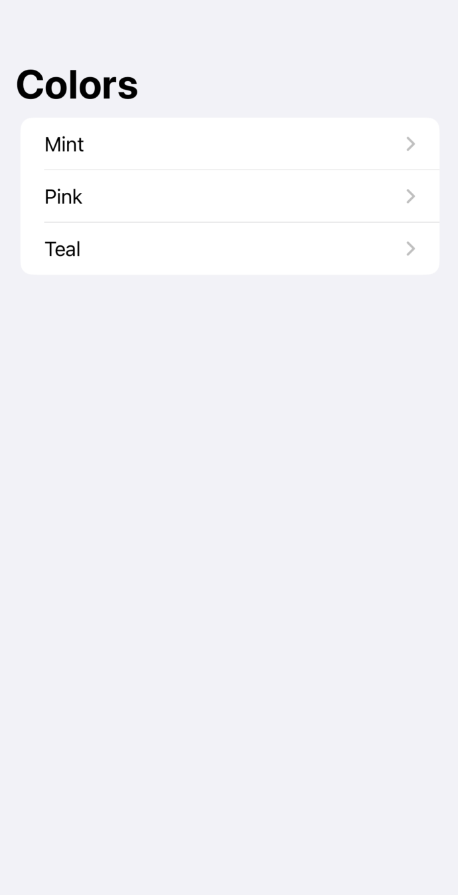

## 💡 NavigationStack

> A view that displays a root view and enables you to present additional views over the root view. </br>
> </br>
> 다른 뷰로 넘어가는 방식 (화면전환의 방식)을 스택처럼 적용한 것
</br>
</br>

선언 </br>

```swift
struct NavigationStack<Data, Root> where Root : View
```

* 항상 제거되지 않은 가장 최근에 추가된 View를 표시
* RootView는 제거할 수 없다.

</br>

NavigationStack을 사용하기 위해선 **NavigationLink**와 **.navigationDestination** 수정자가 필요 </br>
</br>

1. NavigationLink = 제어 뷰 (클릭 시 내가 원하는 View를 나오게 하는 역할)
2. navigationDestination(for:destination:) = Destination View를 NavigationLink에서 제시된 Data 타입과 연결해주는 Method

## 💡 NavigationLink

> A view that controls a navigation presnetation. </br>
> </br>
> 내비게이션 형태로 presnetation을 제어하는 view </br>

</br>

선언 </br>

```swift
struct NavigationLink<Label, Destination> where Label: View, Desitnation : View
```

</br>
</br>

## 💻 예제

1. Navigation을 위한 View 생성

> NavigationStack과 List를 사용해 여러 개의 NavigationLink를 쌓아준다. </br>
</br>

```swift
struct MyNavigationLink: View {
    var body: some View {
            NavigationStack {
                List {
                    NavigationLink("Mint", value: Color.mint)
                    NavigationLink("Pink", value: Color.pink)
                    NavigationLink("Teal", value: Color.teal)
                }
                .navigationTitle("Colors")
            }
    }
}
```


</br>
</br>

2. 클릭시 이동할 뷰 (목적지에 해당하는 뷰) 생성

```swift
struct ColorDetail: View {
    
    var color: Color
    
    var body: some View {
        Text("\(self.color.description)")
    }
}
```
</br>
</br>

3. navigationDestination(for:destination:) 수정자를 이용해 목적지 View를 연결

```swift
struct MyNavigationLink: View {
    var body: some View {
        NavigationStack {
            List {
                NavigationLink("Mint", value: Color.mint)
                NavigationLink("Pink", value: Color.pink)
                NavigationLink("Teal", value: Color.teal)
            }
            .navigationDestination(for: Color.self) {
                color in ColorDetail(color: color)
            }
            
            .navigationTitle("Colors")
        }
    }
}

struct ColorDetail: View {
    
    var color: Color    
    var body: some View {
        Text("\(self.color.description)")
    }
}
```

</br>
</br>

```swift
NavigationLink("Mint", value: Color.mint)
```
> 다음과 같이 NavigationLink에 제시된 Data의 타입은 **Color** </br>

</br>

```swift
.navigationDestination(for: Color.self)
```
> for 파라미터에 해당하는 데이터 타입 = Color </br>

</br>

**이 두개의 타입이 일치하지 않으면 화면 전환이 이루어지지 않는다**

</br>
</br>

### 두 개 이상의 데이터 타입이 존재할 경우

> navigationDestination(for:destination:)을 여러개 사용 </br>

</br>

```swift
struct MyNavigationLink: View {
    var body: some View {
        NavigationStack {
            List {
                NavigationLink("Mint", value: Color.mint) // color 타입
                NavigationLink("Pink", value: "Pink") // string 타입
                NavigationLink("Teal", value: Color.teal)
            }
            .navigationDestination(for: Color.self) {
                color in ColorDetail(color: color)
            }
            .navigationDestination(for: String.self) {
                color in ColorDetailForString(color: color)
            }
            
            .navigationTitle("Colors")
        }
    }
}

struct ColorDetail: View {
    
    var color: Color
    var body: some View {
        Text("\(self.color.description)")
        
    }
}

struct ColorDetailForString: View {
    
    var color: String
    var body: some View {
        Text("\(self.color.description)")
    }
}
```

</br>
</br>

## 💡 Navigation State 관리

> NavigationStack은 Stack이 표시하는 모든 데이터를 나타내는 경로를 추적한다. </br>
> > 즉, 경로에 추가된 모든 value에 대해 NavigationStack은 다른 View를 push </br>
> + Stack에 있는 View는 마음대로 순서를 바꾸거나 제어 가능 </br>

</br>

```swift
struct MyNavigationLink: View {
    @State private var presentedColor: [Color] = [Color.red, Color.blue]
    
    
    var body: some View {
        NavigationStack(path: $presentedColor) {
            // ...   
        }
    }
}
```

</br>


</br>

> NavigationStack은 State를 통해 stack에 쌓여있는 모든 View를 관리하기 때문에 </br>
> 실행 시 [root] -> [red] -> [blue] 차례대로 쌓여있는 것을 확인할 수 있다. </br>


</br>
</br>

```toc
```
