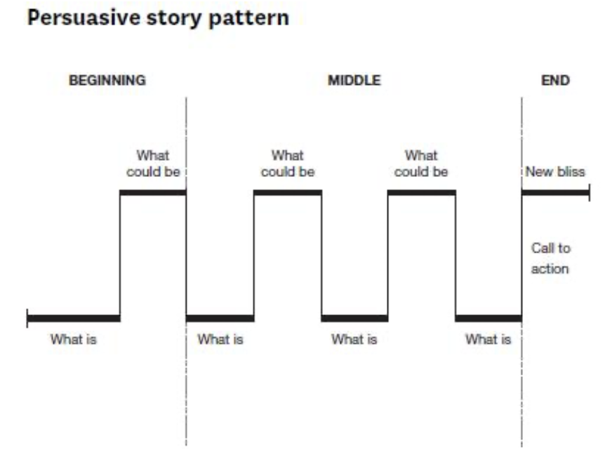

## 👀 (WHY) 스토리 텔링이 중요한 이유

> Stories have value </br>

</br>

성공적인 스토리 텔링의 예시로 **에비앙**과 일본 아오모리 현의 **행운의 사과**를 예시로 들었다. </br>

</br>

## Effective Stories

> 효과적인 스토리가 가진 특징은 무엇일까? </br>

</br>

* 잘 디자인된 구조를 가진
* 청중을 끌어들이는 
* 공감할 수 있는
* 반복 가능한
* 캐릭터가 등장하는 
* 기존의 가정에 도전하는 
</br>


## 👀 (HOW) 어떻게 하면 효과적인 스토리 텔링을 할 수 있을까?

* Story Beats
> 스토리 텔링의 구조와 같은 것 </br>

</br>

### Option A 

1. Every day
2. Then one day
3. Because of that
4. Ever since then

- Pixar에서 사용하고 있는 Story beats

### Option B

1. Situation - who, where, when
2. Complication - conflict, disruption, obstacle, gap
3. Resolution - solution, call to action
4. Result - the new bliss, important outcomes

</br>

* Using data effectively (by Steve Jobs)

> 스티브 잡스의 발표를 예시로 데이터를 어떻게 하면 효과적으로 전달할 수 있는지에 대해 보여주었다. </br>
</br>

We are sell gin over five million songs a day now </br>
Isn't that unbelievable? </br>
Five million songs a day! </br>
That's 58 songs every second of every minute of every hour of every day </br>
</br>
</br>

## Nancy Duarte, Resonate 

</br>

Nancy Duarte에 따르면 스토리 텔링은 **What is**와 **What could be**의 반복이다.

</br>



</br>
</br>

위의 그림에서 처럼 What is와 What could be 사이에는 GAP이 존재하는데, 이 gap을 그대로 둘 경우 이야기 하고자 하는 것이 제대로 전달되지 않을 가능성이 높다. </br>

따라서 이 Gap을 그대로 두지 말고 채워줘야 한다. </br>

### Filling gap with contents 

1. Analytical - Data, Evidence, Fact, Examples, Charts, Diagrams
2. Emotional - Stories, Anedotes, Metaphors, Humor, Surprises


## 🎯 정리

✨ 매력있는 스토리 텔링에 필요한 것들  </br>

* 공감 : 살아 숨쉬는 캐릭터의 사실감
* 구조 : 이해가 쉬운 이야기 & 반복가능한 이야기
* 단서 : 이 이야기를 하는 이유에 대해서
* 데이터 : 맥락에 필요한 정보를 전달

> Storytelling is like a magin wand 
</br>
</br>

```toc
```
