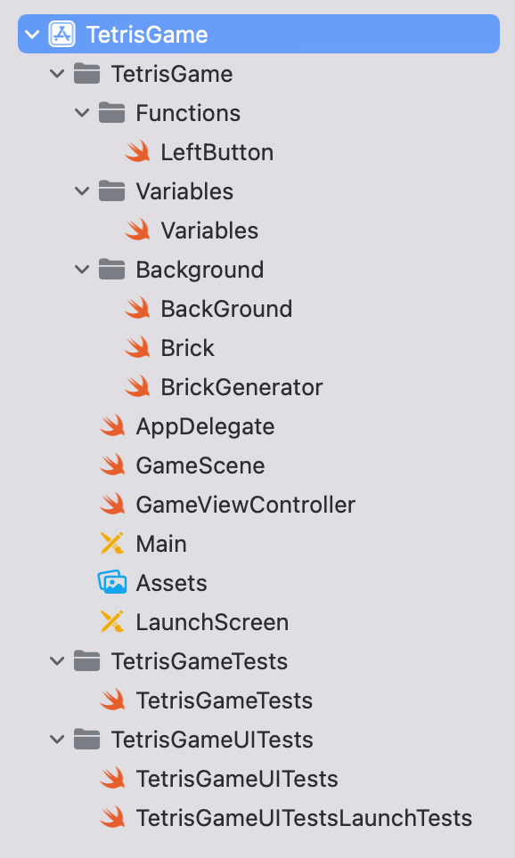

## ☠️ 오류 내용

2023-03-12 19:30:15.653050+0900 TetrisGame[8542:367066] [SceneConfiguration] **Info.plist contained no UIScene configuration dictionary (looking for configuration named "(no name)")**

</br>
</br>

> Info.plist 파일에 UIScene 구성 사전이 없다는 내용이다. </br>
</br>



</br>

디렉토리를 살펴봤더니 다음과 같이 Info.plist 파일이 모두 사라져 있었다.

</br>
</br>

검색해본 결과 </br>
> Xcode13부터 신규 프로젝트 생성 시 info.plist파일이 프로젝트 내부로 들어가 디렉토리 상에서 찾을 수 없다고 하였다.


</br>
</br>

```toc
```
