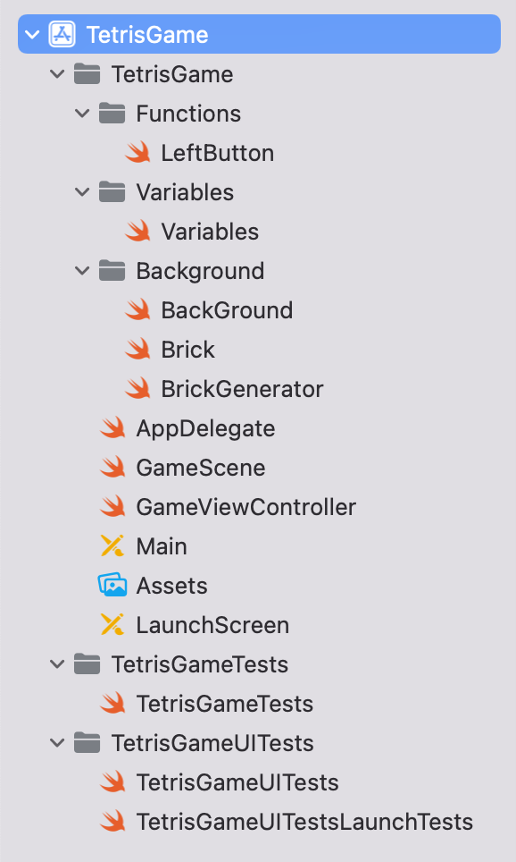
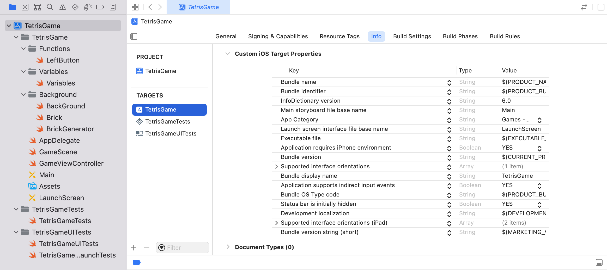
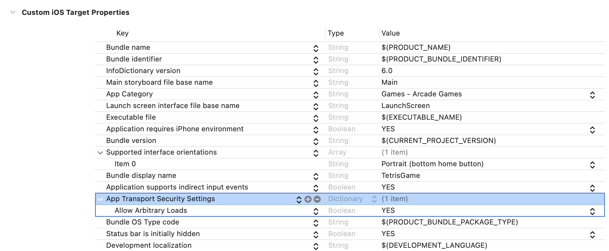

## ☠️ 오류 내용

2023-03-12 19:30:15.653050+0900 TetrisGame[8542:367066] [SceneConfiguration] **Info.plist contained no UIScene configuration dictionary (looking for configuration named "(no name)")**

</br>
</br>

> Info.plist 파일에 UIScene 구성 사전이 없다는 내용이다. </br>
</br>



</br>

디렉토리를 살펴봤더니 다음과 같이 Info.plist 파일이 모두 사라져 있었다.

</br>
</br>

검색해본 결과 </br>
> Xcode13부터 신규 프로젝트 생성 시 info.plist파일이 프로젝트 내부로 들어가 디렉토리 상에서 찾을 수 없다고 하였다.

</br>
</br>
</br>

## 🔎 해결방법



</br>

1.  다음과 같이 **PROJECT -> TARGETS -> Info** 로 접근 </br>

</br>



</br>

2. Key에 **'App Transport Security'**를 추가하고 </br>
하위에 **'Allow Arbitrary Loads'**를 추가한 다음, </br>
Value를 **'Yes'**로 설정

</br>
</br>

[사진](./4.png)

</br>

> 이전에 없던 info 파일이 생성되었다.

</br>
</br>

[사진](./5.png)

</br>

3. Key에 **'Application Scene Manifest'**르 추가하고 </br>
하위에 **'Scene Configuration'**을 추가

</br>
</br>

[사진](./result.png)
</br>

> 다음과 같이 해당 에러가 사라진 것을 볼 수 있다.

</br>
</br>

## 🧠 Info.plist 파일

> Info.plist = Information Property List Files </br>
</br>

* Info.plist 파일은 **실행 패키지에 관한 필수 설정 정보**가 포함된 구조화된 텍스트 파일
* 일반적으로 유니코드 UTF-8로 인코딩되면 내용은 XML 사용
* key, value로 구성된 딕셔너리 형태
* 시스템은 이 key와 value를 사용해 앱과 앱의 설정을 가져오므로, 플러그인/프레임워크/앱에는 Info.plist가 존재해야한다.

</br>
</br>


```toc
```
