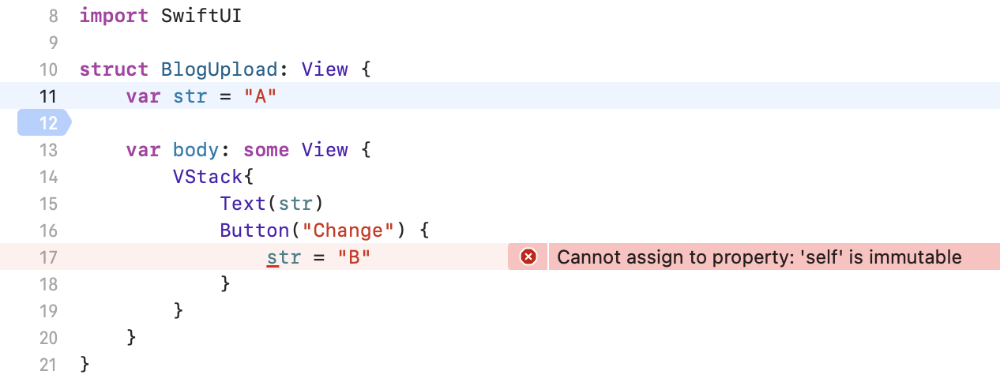
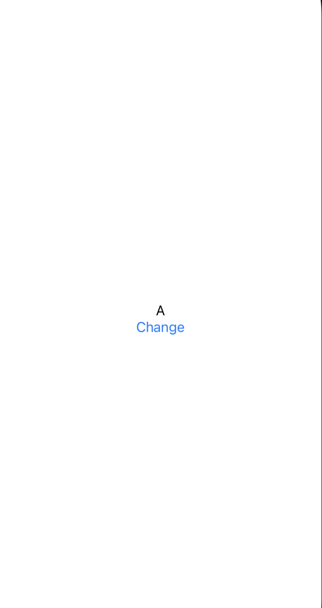
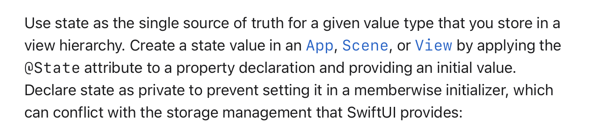
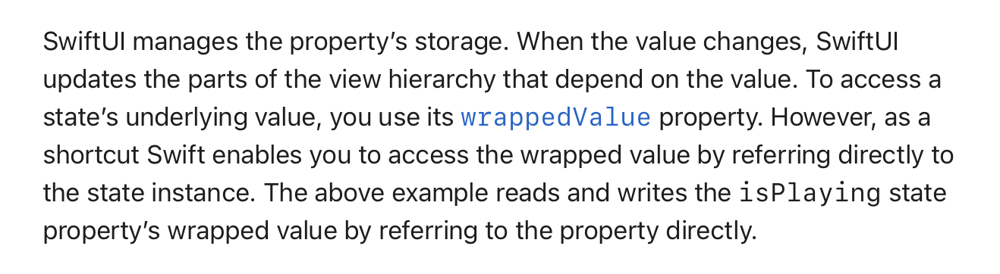
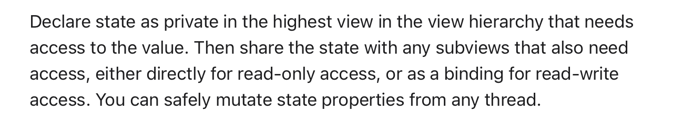
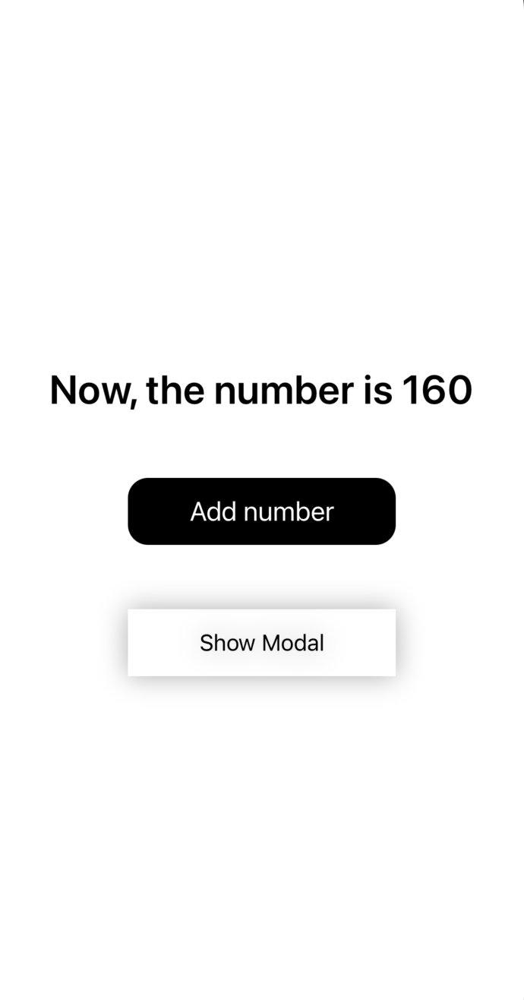

## SwiftUI에서 데이터 바인딩이 필요한 이유

SwiftUI에서 View는 **struct(구조체)형태**이다. </br>
따라서 구조체이기에 *내부에서 프로퍼티를 변경하는 것이 불가능*하다. </br>

</br>

```swift
struct BlogUpload: View {
    var str = "A"
    
    var body: some View {
        VStack{
            Text(str)
            Button("Change") {
                str = "B"
            }
        }
    }
}
```
</br>



</br>

> 다음 코드와 같이 A로 정의된 값을 내부에서 B로 변경하려고 할 때, </br>
> *'Cannot assign to property: 'self'is immutable*과 같은 오류가 발생한다. </br>
> </br>
> 따라서 이와 같은 문제를 해결하기 위해 @State를 사용한 데이터 바인딩이 필요하다. </br>
</br>

## 💡 @State
> A property wrapper type that can read and write a value managed by SwiftUI </br>
</br>
</br>

사용법 </br>
> 변수 앞에 @State 붙이기만 하면 됨 </br>

```swift
@State var str = "A"
```

</br>
</br>

* Property Wrapper : 변화가 생기면 해당 변수의 값을 읽거나 새로 쓸 수 있다.
* State value 값이 변경되면 뷰는 해당 value의 apperance를 무효화 하고 새롭게 body 값을 계산
* State 변수값이 변경되면 view를 다시 랜더링하기 때문에 항상 최신 값을 가짐
* State 인스턴스는 그 자체로 값이 아닌, 값을 읽고 쓰는 것을 의미
* @State 속성으로 어떤 프로퍼티의 초기값을 지정했다면, 다른 값으로 재할당 불가능 -> **@Binding** 변수를 통해서만 가능  
* @State는 **private**이고 다른 View와 공유되지 않음
* SwiftUI는 state로 선언된 property들의 저장소를 관리 -> Property Wrapper로 감싼 변수는 View가 소유하고 있지 않는다.

</br>
</br>

```swift
struct BlogUpload: View {
    @State var str = "A"
    
    var body: some View {
        VStack{
            Text(str)
            Button("Change") {
                str = "B"
            }
        }
    }
}
```
</br>

> 앞선 코드를 @State를 사용해 정의해주게 되면 더이상 오류가 발생 하지 않는다. </br>



</br>
</br>

### 📝 Docs



</br>

```swift
 @State private var isPlaying: Bool = false // Create the state. 
```

</br>

> App, Scene 또는 View에서 상태 값을 생성하려면, 속성 선언에 **@State 속성(attribute)**을 적용하고 **초기값**을 제공해야 한다. </br>
> **private** 선언을 통해 저장 관리(storage management)와 충돌 방지

</br>
</br>



</br>

> SwfitUI에서는 속성들의 저장을 자동으로 관리 </br>
> 값이 변경되면 이에 영향 받는 뷰 계층의 일부분을 업데이트 </br>

```swift
struct PlayButton: View {
    @State private var isPlaying: Bool = false // Create the state.

    var body: some View {
        Button(isPlaying ? "Pause" : "Play") { // Read the state.
            isPlaying.toggle() // Write the state.
        }
    }
}
```

</br>

> isPlaying 상태 속성의 래핑된 값을 직접 참조하여 읽고 쓰기 가능 </br>

</br>



</br>

> 상태(state)를 사용하는 가장 높은 뷰 계층(highest view in the view hierarchy) 중에서 상태 값을 필요로 하는 뷰에서 해당 상태를 private으로 선언 </br>
> 하위 뷰들은 이를 직접적으로 읽기 전용으로 접근하거나, 읽기 및 쓰기 권한을 위해 바인딩(binding)으로 공유 가능 </br>
>  이러한 상태(state) 속성은 *어떤 스레드(thread)에서든 안전하게 변경 가능*

</br>
</br>

### ⭐️ 정리

* SwiftUI에서는 상태(state)를 사용하여 값을 저장하고 관리할 수 있으며, 상태를 **private**으로 선언하여 안전하게 관리하는 것이 중요 
* @State 속성을 사용하여 **초기값을 제공**하여 SwiftUI에서 해당 상태 값을 적절하게 처리할 수 있도록 해야 함
* SwiftUI에서는 State 속성의 저장과 업데이트를 자동으로 처리하며, 래핑된 값을 **직접 참조하여 액세스 가능**
* SwiftUI에서는 상태(state)를 **최상위 뷰**에서 선언하고, @Binding으로 하위 뷰들에게 전달하여 상태 값을 공유하고, 이를 안전하게 변경 가능

</br>
</br>

## 💡 @StateObject

## 💡 @Binding

> A property wrapper type that can read and write a value owned by a source of truth </br>
> </br>
> @State로 선언된 속성을 다른 뷰에서 사용하려 할 때 @Bindging 사용 </br>

</br>

사용법 </br>
> 변수 앞에 **$(달러)**을 붙여 바인딩 변수임을 나타냄 </br>

```swift
struct BlogUpload: View {
    @State var toggle = false
    
    var body: some View {
        VStack{
            Toggle("토글버튼", isOn: $toggle)
            
        }
    }
}
```

</br>

* 외부에서 접근해야 하기 때문에 private X

</br>
</br>

## 👀 예시

```swift
import SwiftUI

struct BlogUpload: View {
    @State var num : Int = 160
    @State var isShowingModal: Bool = false
    
    var body: some View {
        VStack{
            Text("Now, the number is \(num)")
                .font(.system(size: 30))
                .bold()
                .padding(.bottom, 40)
            
            Button(action:
                    {self.num += 1},
                   label: {Text("Add number")
                    .frame(width: 200, height: 50)
                    .background(Color.black)
                    .cornerRadius(15)
                    .foregroundColor(.white)
                    .font(.system(size: 20))
            })
            .padding(.bottom, 40)
            
            Button(action:
                    {isShowingModal = true},
                   label: {Text("Show Modal")
                    .frame(width: 200, height: 50)
                    .background()
                    .shadow(radius: 10)
                    .foregroundColor(.black)
            }) .sheet(isPresented: $isShowingModal){
                ZStack{
                    Color.black.ignoresSafeArea()
                    Text("Check the number : \(num)")
                        .font(.system(size: 30))
                        .foregroundColor(.white)
                    
                }
            }
            
        }
    }
}
```
</br>
</br>

 

</br>
</br>

```toc
```