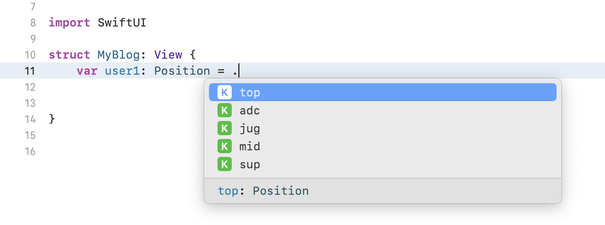
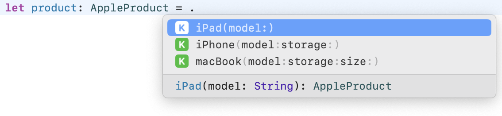

## 💡 Enum 개념

> 연관된 항목들을 묶어서 표현할 수 있는 타입 </br>
> 이미 정해놓은 입력 값만 선택해서 사용하고 싶을 떄 유리 </br>
> -> 정의해 준 항목 외에는 추가 / 수정 불가능 </br>

</br>
</br>

즉, 열거형은 다음과 같은 경우 유용 </br>

</br>

* 제한된 선택지를 주고 싶을 떄
* 정해진 값 외에는 입력받고 싶지 않을 때
* 예상된 입력 값이 한정되어 있을 떄

</br>
</br>

## 💡 열거형을 사용하는 이유

1. 깔끔하고 간결한 코드 

```swift
// 대룩별 나라 구분

enum Asia {
    case korea, japan, china
}

enum America {
    case usa
    case mexico
    case panama
}

enum Europe {
    case france
    case germany
    case spain
}
```

> 다음과 같이 열거형을 사용해 코드를 짤 경우 각 대륙 안에 어떤 국가가 있는지 한눈에 알아볼 수 있다. </br>

</br>

2. 코드 작성이 편리 

```swift
// 1) 열거형으로 선언
enum Capital:String {
    case KualaLumpur = "Malaysia"
}
print(Capital.KualaLumpur)

// 2) 그냥 선언
let capital = ["KualaLumpur":"Malaysia"]

print(capital["KualaLumpur"])
```
> 위 두개의 코드는 모두 말레이시아 수도 쿠알라룸푸르를 선언하고 있다. </br>
> 두 가지의 코드로 수도(KualaLumpur)를 출력 하려고 할 떄, 열거형으로 선언할 경우에는 Capital 입력 시, 자동완성을 통해 어려운 철자를 입력하지 않아도 된다. 
</br>
</br>

3. 코드 실수를 줄일 수 있다. 

```swift
// 결과의 성공 / 실패 여부를 나타내는 코드를 작성할 경우

let result = "failure"
let result2 = "failed"
let result3 = "fail"
```
> 다음과 같이 모두 같은 실패를 나타내지만, result가 아닌 다른 이름을 사용하면 쓸데없는 코드들이 많아지고 오류가 잦아진다. </br>
</br>

대신 위의 코드는 다음과 같이 나타낼 수 있다. </br>

```swift
enum Result {
    case success
    case failure
}
```

</br>
</br>

## 💡 열거형 졍의 

### 원시값이 없는 열거형

```swift
enum Position {
    case top, mid, jug, adc, sup
}
```



> 사진과 같이 .(점문법)을 통해 선언한 case에 접근할 수 있다. </br>

</br>
</br>

### 원시값(raw value)이 있는 열거형

* 원시값(Raw Value)가 될 수 있는 자료형

1. Number Type
2. Character Type
3. String Type

> ❗️enum 선언 시 이름 옆에 반드시 Type을 명시❗️ </br>

</br>

```swift
enum Position: Int{
    case top    // 0
    case mid    // 1
    case jug    // 2
    case adc    // 3
    case sup    // 4
}

enum Position: Int{
    case top = 0     // 0
    case mid = 10    // 10
    case jug         // 11
    case adc = 20    // 20
    case sup         // 21
}
```

* Int 타입 선언시 가장 먼저 선언된 case부터 0 ~ 1씩 증가된 값
* Raw value가 없는 case는 바로 이전 case의 값 + 1
* Int가 아닌 다른 Number 자료형 (Double, Float) 사용 시 바로 이전 case의 Raw value를 정수 값으로 해야함

</br>
</br>

```swift
enum Position: Charactor {
    case top = "t"
    case mid = "m"
    case sup = "s"
}
```

* Character Type을 가지는 열거형의 경우 모든 case에 대한 Raw value를 직접 선언 해야한다.

</br>
</br>

```swift
enum Position: String {
    case top            // top
    case mid = "M"      // M
    case sup            // sup
}
```

* String Type의 경우 Charactor와 다르게 선언하지 않은 값에 대해서는 case이름과 동일한 원시값이 주어진다. 
* 원시값 접근 시 .rawValue 속성을 통해 접근 가능 

</br>
</br>

## 💡 Enum associated values (연관 값)

### 선언 

> case 옆에 튜블 형태로 원하는 Type 명시 </br>

```swift
enum TypeName {
    case caseName(Type)
    case caseName(Type, Type, ...)
}
```

</br>
</br>

```swift
enum AppleProduct {
    case iPad(model: String)
    case iPhone(model: String, storage: Int)
    case macBook(model: String, storage: Int, size: Int)
}
```

### 사용



</br>

```swift
let product: AppleProduct = .iPhone(model: "12pro")
```

> 직접 값을 지정해서 사용 가능

### Switch 구문에서의 사용 

```swift
switch product {
    case .iPad("12pro"): break      
    case .iPad: break
    case .iPhone("13", _): break
    case .iPhone(let model, var storage): break
    case let .macBook(model, storage, size): break
}
```
</br>

1. 

```swift
case .iPad("12pro"): break      // 연관값이 12pro면 매칭
```

</br>

2. 

```swift
case .iPad: break      // 연관값 무시
```

</br>

3. 

```swift
case .iPhone("13", _): break      // 연관값 생략 가능
```

</br>

4. 

```swift
case .iPhone(let model, var storage): break      // 연관값 상수(변수) 바인딩
```

</br>

5. 

```swift
case let .macBook(model, storage, size): break      // let 바인딩 시 let 맨 앞으로 빼기 가능 
```

</br>


</br>
</br>

```toc
```