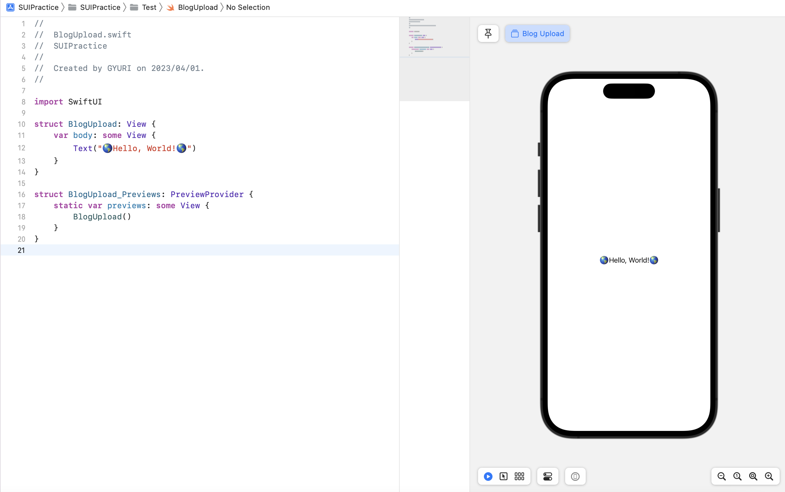
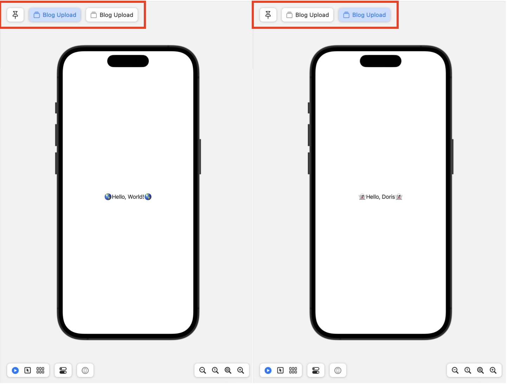
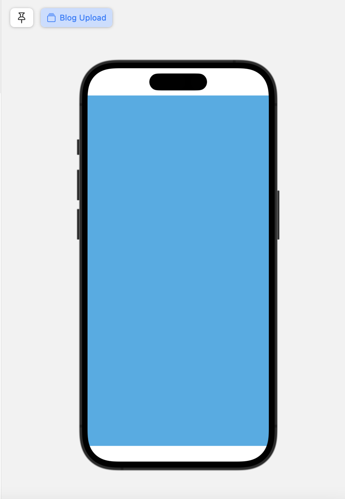
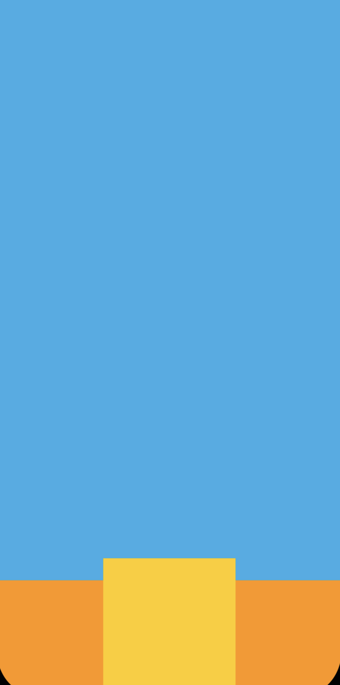
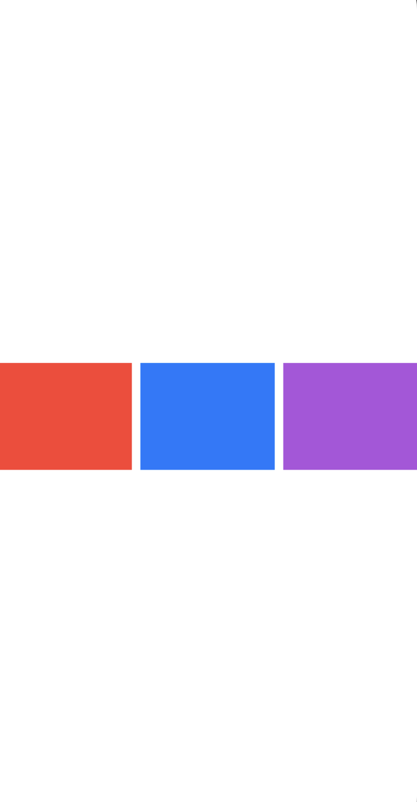

## 💡 SwiftUI에서의 View

> SwiftUI는 AutoLayout과 달리, 본인이 속한 부모뷰와 본인의 콘텐츠에 동시에 영향을 받아 자동으로 Layout이 결정 </br>
> UIKit에서 프레임을 설정하는 것과 달리, SwiftUI의 수식어는 뷰를 직접 변경하는 것이 아닌, 원래의 뷰를 수식하는 *새로운 뷰를 반환* </br>

</br>
</br>

```swift
import SwiftUI

struct ContentView: View {
    var body: some View {
        Text("Hello, world!")
    }
}

struct ContentView_Previews: PreviewProvider {
    static var previews: some View {
        ContentView()
    }
}
```

* SwiftUI에서 뷰는 View 프로토콜을 따르는 구조체로 선언되고, 그 View 프로토콜을 따르기 위해서는 body 프로퍼티를 가지고 있어야 하며, 그 안에 View가 선언되어야 한다.



> 사진과 같이 미리보기를 할 수 있는 이유는 BloadUpload뷰에 대한 PreviewProvider가 설정되어 있기 때문 

</br>
</br>

* ⭐️ 하나의 body 프로퍼티는 단 1개의 뷰를 반환하도록 구성

```swift
import SwiftUI

struct BlogUpload: View {
    var body: some View {
        Text("🌎Hello, World!🌎")
        Text("👻Hello, Doris👻")
    }
}

struct BlogUpload_Previews: PreviewProvider {
    static var previews: some View {
        BlogUpload()
    }
}
```


</br>

> 다음 코드에서와 같이 두개의 Text를 입력하더라도 위 사진에서처럼 하나의 뷰에 Text 두개가 나타나는 것이 아닌 Preview가 두개 생기는 것을 볼 수 있다. </br>
> ⭐️ 따라서 새로운 뷰를 추가하기 위해서는 VStack, HStack, ZStack등을 통해 컨테이너 뷰들을 배치해야 한다.

</br>
</br>

## 💡 View의 크기를 정하는 .frame

> View의 매서드인 frame은 View의 전체 크기를 정해준다.

</br>

```swift
import SwiftUI

struct BlogUpload: View {
    var body: some View {
        Rectangle()
            .foregroundColor(.cyan)
    }
}
```


</br>
</br>

```swift
struct BlogUpload: View {
    var body: some View {
        Rectangle()
            .foregroundColor(.cyan)
            .frame(width: 300, height: 300)
    }
}
```

</br>
</br>

### 🔑 주요 특징

* 내부 View의 크기가 정해져있으면 이를 상위 View가 마음대로 조정할 수 없다.
> 따라서 내부 View안에 frame이 사용되었다면 면밀히 삺피고 배치해야할 필요가 있다. </br>

```swift
import SwiftUI

struct BlogUpload: View {
    var body: some View {
        VStack(spacing: 0){
            Rectangle()
                .foregroundColor(.cyan)
            
            VStack {
                Rectangle()
                    .foregroundColor(.yellow)
                    .frame(width: 150, height: 150)
            }
            
            .frame(width: 400, height: 100)
            .background(Color.orange)
        }
    }

```


> 사진에서 볼수 있듯 orange색의 높이 100의 frame을 만들어주었음에도 불구하고, yellow 색의 사각형은 위로 튀어 나온 것을 볼 수 있다. </br>
> </br>
> 만약 VStack 높이를 맞추고 싶다면, View의 크기를 완전히 고정시키는 것이 아닌, </br>
> 너비나 높이의 **최댓값, 최솟값을 정하는 방식**으로 정의해주어야 한다.

</br>
</br>

```swift
struct BlogUpload: View {
    var body: some View {
        HStack {
            Rectangle()
                .foregroundColor(.red)
                .frame(minWidth: 0, maxWidth: .infinity)
            
            Rectangle()
                .foregroundColor(.blue)
                .frame(minWidth: 0, maxWidth: .infinity)
            
            Rectangle()
                .foregroundColor(.purple)
                .frame(minWidth: 0, maxWidth: .infinity)
        } .frame(height: 100)
    }
}
```

</br>



<br>

> 위 사진처럼 최소 너비를 0, 최대 너비를 infinity로 잡아줌으로써 주어진 공간을 3등분할 수 있다. 

## .padding

## Spacer()

</br>
</br> 

```toc
```