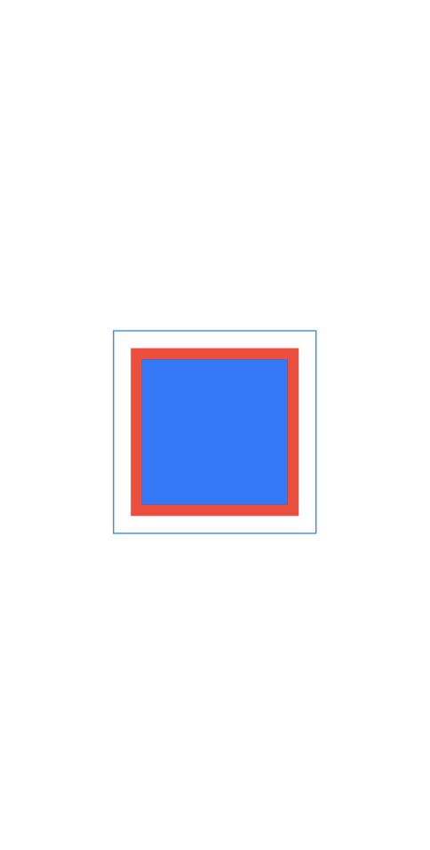
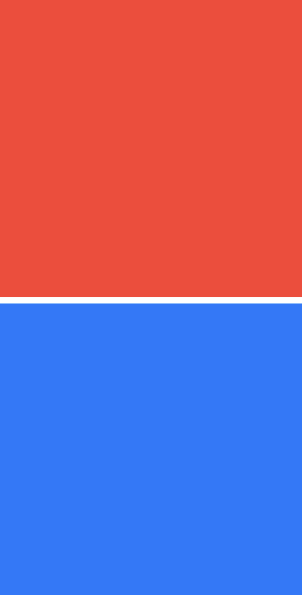
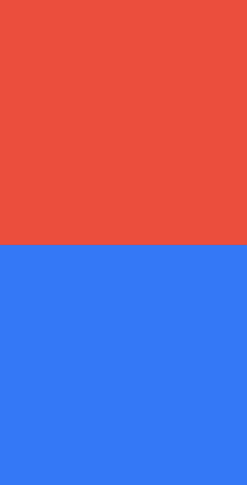

## 💡 SwiftUI에서의 View

> SwiftUI는 AutoLayout과 달리, </br>
> 본인이 속한 부모뷰와 본인의 콘텐츠에 동시에 영향을 받아 자동으로 Layout이 결정 </br>
> UIKit에서 프레임을 설정하는 것과 달리, </br>
> SwiftUI의 수식어는 뷰를 직접 변경하는 것이 아닌, 원래의 뷰를 수식하는 *새로운 뷰를 반환* </br>

</br>
</br>

```swift
import SwiftUI

struct ContentView: View {
    var body: some View {
        Text("Hello, world!")
    }
}

struct ContentView_Previews: PreviewProvider {
    static var previews: some View {
        ContentView()
    }
}
```

* SwiftUI에서 뷰는 View 프로토콜을 따르는 구조체로 선언되고, 그 View 프로토콜을 따르기 위해서는 body 프로퍼티를 가지고 있어야 하며, 그 안에 View가 선언되어야 한다.


> 사진과 같이 미리보기를 할 수 있는 이유는 BloadUpload뷰에 대한 PreviewProvider가 설정되어 있기 때문 

</br>
</br>

* ⭐️ 하나의 body 프로퍼티는 단 1개의 뷰를 반환하도록 구성

```swift
import SwiftUI

struct BlogUpload: View {
    var body: some View {
        Text("🌎Hello, World!🌎")
        Text("👻Hello, Doris👻")
    }
}

struct BlogUpload_Previews: PreviewProvider {
    static var previews: some View {
        BlogUpload()
    }
}
```


</br>

> 다음 코드에서와 같이 두개의 Text를 입력하더라도 위 사진에서처럼 하나의 뷰에 Text 두개가 나타나는 것이 아닌 Preview가 두개 생기는 것을 볼 수 있다. </br>
> ⭐️ 따라서 새로운 뷰를 추가하기 위해서는 VStack, HStack, ZStack등을 통해 컨테이너 뷰들을 배치해야 한다.

</br>
</br>

## 💡 View의 크기를 정하는 .frame

> View의 매서드인 frame은 View의 전체 크기를 정해준다.

</br>

```swift
import SwiftUI

struct BlogUpload: View {
    var body: some View {
        Rectangle()
            .foregroundColor(.cyan)
    }
}
```


</br>
</br>

```swift
struct BlogUpload: View {
    var body: some View {
        Rectangle()
            .foregroundColor(.cyan)
            .frame(width: 300, height: 300)
    }
}
```

</br>
</br>

### 🔑 Key Point

* 내부 View의 크기가 정해져있으면 이를 상위 View가 마음대로 조정할 수 없다.
> 따라서 내부 View안에 frame이 사용되었다면 면밀히 삺피고 배치해야할 필요가 있다. </br>

```swift
import SwiftUI

struct BlogUpload: View {
    var body: some View {
        VStack(spacing: 0){
            Rectangle()
                .foregroundColor(.cyan)
            
            VStack {
                Rectangle()
                    .foregroundColor(.yellow)
                    .frame(width: 150, height: 150)
            }
            
            .frame(width: 400, height: 100)
            .background(Color.orange)
        }
    }

```


> 사진에서 볼수 있듯 orange색의 높이 100의 frame을 만들어주었음에도 불구하고, yellow 색의 사각형은 위로 튀어 나온 것을 볼 수 있다. </br>
> </br>
> 만약 VStack 높이를 맞추고 싶다면, View의 크기를 완전히 고정시키는 것이 아닌, </br>
> 너비나 높이의 **최댓값, 최솟값을 정하는 방식**으로 정의해주어야 한다.

</br>
</br>

```swift
struct BlogUpload: View {
    var body: some View {
        HStack {
            Rectangle()
                .foregroundColor(.red)
                .frame(minWidth: 0, maxWidth: .infinity)
            
            Rectangle()
                .foregroundColor(.blue)
                .frame(minWidth: 0, maxWidth: .infinity)
            
            Rectangle()
                .foregroundColor(.purple)
                .frame(minWidth: 0, maxWidth: .infinity)
        } .frame(height: 100)
    }
}
```

</br>


<br>

> 위 사진처럼 최소 너비를 0, 최대 너비를 infinity로 잡아줌으로써 주어진 공간을 3등분할 수 있다. </br>
</br>

* min / max값을 사용하면 padding, spacerc처럼 View 사이에 빈 공간을 주는 것이 아닌 View 자체의 영역이 커지는 것

</br>
</br>

## 💡 View의 상하좌우 간격을 주는 .padding()

> frame의 각 변에 여백을 추가해주는 것으로, defalut는 padding(16)이다.

</br>
</br>

### 🔑 Key Point

* padding을 사용할 땐 modifier의 순서에 주의

```swift
struct BlogUpload: View {
    var body: some View {
        Rectangle()
            .foregroundColor(.blue)
            .frame(width: 150, height: 150)
            .border(Color.red)
            .padding()
            .border(Color.blue)
    }
}
```


</br>

> 위 코드에서처럼 빨간색으로 border를 설정해준 다음 padding값을 주게 되면 border가 포함된 frame 각 변에 padding처리가 된다. </br>

</br>

* 이러한 padding은 자잘한 View들 사이 간격을 디자인 상 정확한 수치로 여백을 주어야할 때 사용하면 편리한다.

</br>
</br>

## 💡 빈 공간을 할당해주는 Spacer()

> View의 일종이긴 하지만, 그냥 '공간'

</br>

> View를 한쪽이나 양쪽으로 밀어버리기 위해 Spacer()를 사용 </br>
> Stack 밖에서도 사용할 수 있으나 의도대로 사용하기 위해선 Stack 안에서 사용하는 것이 좋다.

* Spacer의 최소 간격은 8이긴 하지만, minLength값을 0으로 설정해주게 되면 중간간격을 없애 줄 수 있다.

```swift
struct BlogUpload: View {
    var body: some View {
        VStack{
            Rectangle()
                .foregroundColor(.red)
                .frame(height: UIScreen.main.bounds.height / 2)
                
            Spacer()
            
            Rectangle()
                .foregroundColor(.blue)
                .frame(height: UIScreen.main.bounds.height / 2)
        }
    }
}
```


</br>
</br>

```swift
struct BlogUpload: View {
    var body: some View {
        VStack{
            Rectangle()
                .foregroundColor(.red)
                .frame(height: UIScreen.main.bounds.height / 2)
                
            Spacer(minLength: 0)
            
            Rectangle()
                .foregroundColor(.blue)
                .frame(height: UIScreen.main.bounds.height / 2)
        }
    }
}
```


</br>
</br>

## 🤔 정리

**Frame**은 View 자체의 높이와 너비, 즉 사이즈를 지정할 때 </br>
**Padding**은 View의 각 변(top, bottom, leading, trailing)의 여백을 지정할 때 </br>
**Spacer**은 Stack에 소속된 View들 사이의 거리를 지정할 때 </br>


</br>
</br> 

```toc
```