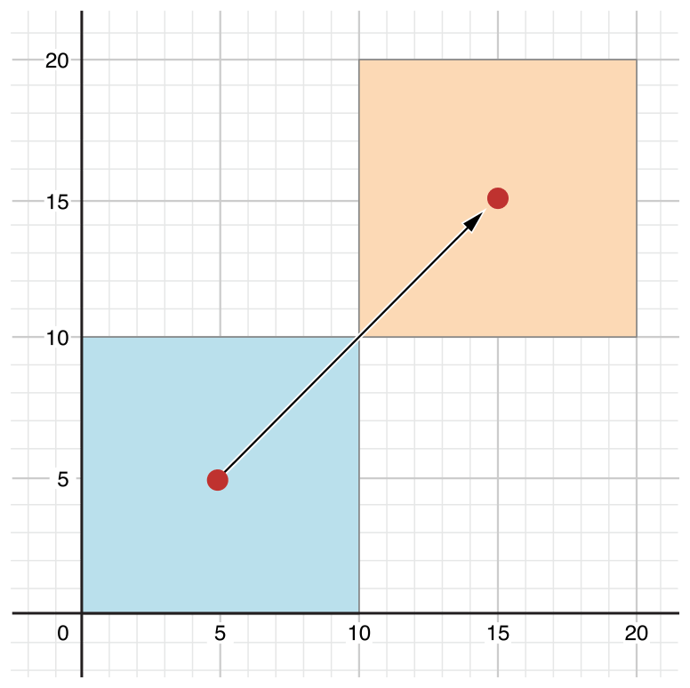

## 💡 프로퍼티 (Property)

✨ 프로퍼티는 **클래스, 구조체, 열거형**과 관련한 값 </br>
✨ 프로퍼티의 종류에는 _저장 프로퍼티(Stored Property)_와 _계산된 프로퍼티(Computed Property)_가 있다. </br>

</br>

### 1. 저장 프로퍼티 (Stored Property)

> 단순히 값을 저장하고 있는 프로퍼티 </br>
> **let**을 사용해 상수 또는 **var**를 사용해 변수로 선언해 사용 가능 </br>
> 클래스와 구조체(열거형 X) 에서만 사용기능

</br>

```swift
struct FixedLengthRange {
    var firstValue: Int
    let length: Int
}

var rangeOfThreeItems = FixedLengthRange(firstValue: 0, length: 3)
// -> 범위 값은 0, 1, 2 

rangeOfThreeItems.firstValue = 6
// -> 범위 값은 6, 7, 8 
```
</br>
</br>

#### 상수 구조체 인스턴스의 저장 프로퍼티 

* 구조체를 상수(let)로 선언하면 구조체 인스턴스의 프로퍼티 변경 불가능
* 클래스 인스턴스는 let으로 선언하더라도 프로퍼티 변경 가능

```swift
let rangeOfFourItems = FixedLengRange(firstValue: 0, length: 4)
// -> 범위 값은 0, 1, 2, 3

rangeOfFourItems.firstValue = 6
// ❌ error code ❌
```

</br>
</br>

#### 지연 저장 프로퍼티 

* 값이 처음으로 사용되기 전에는 계산되지 않는 프로퍼티
* **lazy** 키워드 사용
* 요소가 끝나기 전에 적절한 값을 알지 못하는 경우에 유용
* 실제 사용되기 전에는 실행되지 않으므로 인스턴스의 초기화 시점에 복잡한 계산 회피 가능

> 📝 </br>
> 지연 프로퍼티는 반드시 변수(var)로 선언 </br>
> 상수(let) = 초기화 되기 전에 항상 값을 갖는 프로퍼티 </br>
> BUT, 지연 프로퍼티는 처음 사용되기 전에는 값을 갖지 않음

</br>
</br>

```swift
// 외부 파일에서 데이터를 가져오는 클래스 생성
// 초기화하는데 매우 많은 시간이 소요된다고 가정 

class DataImporter {
    var filename = "data.txt"
}

// 데이터 관리 기능 클래스 선언 가정
class DataManager {
    lazy var importer = DataImporter()
    var data = [String]()
}

let manager = Datamanager()
manager.data.append("Some data")
manager.data.append("Some more data")
// ⭐️ DataImporter 인스턴스는 이 시점에 생성돼 있지 않다.
```
* DataManager 클래스는 DataImport클래스를 가지고 있지만 지연 프로퍼티로 선언하였으므로 DataManager의 인스턴스 manager를 만들고 data를 추가시키는 동안 DataImporter인스턴스는 생성되지 않는다.

</br>
</br>

```swift
print(manager.importer.filename)
// 다음과 같이 importer 프로퍼티에 처음 접근할 때 importer 인스턴스는 생성
```

</br>
</br>

### 2. 계산된 프로퍼티 (Computed Property)


* 값을 저장하고 있지 않고 특정하게 계산한 값을 반환해 주는 프로퍼티
* 클래스, 구조체, 열거형 모두에서 사용 가능 
* 키워드 **get**과 **set**을 통해 *(getter와 optional한 setter를 제공)* 값을 탐색하고 간접적으로 다른 프로퍼티 값을 설정할 수 있는 방법을 제공 

</br>
</br>

```swift
// 좌표와 크기를 갖는 사각형을 표현하는 구조체

struct Point {
    var x = 0.0, y = 0.0
}
struct Size {
    var width = 0.0, height = 0.0
}

struct Rect {
    var origin = Point()
    var size = Size()
    var center: Point {
        get {
            let centerX = origin.x + (size.width / 2)
            let centerY = origin.y + (size.height / 2)
            return Point(x: centerX, y: centerY)
        }
        // get : 다른 좌표와 크기 프로퍼티들을 연산하여 중점 표현
        set(newCenter) {
            origin.x = newCenter.x - (size.width / 2)
            origin.y = newCenter.y - (size.height / 2)
        }
        // set : 사각형의 중점 직접 설정
        // x,y 좌표가 어떤 값을 가져야 하는지 계산해서 x,y에 적절한 좌표값 넣어줌
    }
}
```
> 💻 </br>
> center : 사각형의 중점을 표현하는 계산된 프로퍼티 </br>

</br>

```swift
var square = Rect(origin: Point(x: 0.0, y: 0.0),
                  size: Size(width: 10.0, height: 10.0))
                  
let initialSquareCenter = square.center
square.center = Point(x: 15.0, y: 15.0)

print("square.origin is now at (\(square.origin.x), \(square.origin.y))")

// -> square.origin is now at (10.0, 10.0)
```



</br>
</br>

#### 💭 Setter 선언의 간략한 표현

* 앞선 코드에서 Setter의 인자 이름을 set(newCenter)라고 명시했지만, 인자 이름(newCenter)을 지정하지 않으면 *인자 기본 이름인 **newValue*** 사용 가능

```swift
struct AlternativeRect {
    var origin = Point()
    var size = Size()
    var center: Point {
        get {
            let centerX = origin.x + (size.width / 2)
            let centerY = origin.y + (size.height / 2)
            return Point(x: centerX, y: centerY)
        }
        set {
            origin.x = newValue.x - (size.width / 2)
            origin.y = newValue.y - (size.height / 2)
        }
    }
}
```

</br>
</br>

#### 읽기전용 계산된 프로퍼티

* getter만 있고 setter를 제공하지 않는 계산된 프로퍼티 
* 반드시 반환 값을 제공하고 다른 값을 지정할 수는 없는 프로퍼티

```swift
struct Cuboid {
    var width = 0.0, height = 0.0, depth = 0.0
    var volume: Double {
        return width * height * depth
    }
}
// volume : 읽기 전용 계산된 프로퍼티
```

</br>
</br>

> 📝 </br>
> 반드시 **var**로 선언 (let❌) </br>

</br>
</br>

### 3. 타입 프로퍼티 (Type Property)

* 특정 타입에 속한 프로퍼티로 그 타입에 해당하는 단 하나의 프로퍼티만 생성된다.
* 특정 타입의 모든 인스턴스에 공통적으로 사용되는 값을 정의할 때 유용
* 항상 **초기값**을 지정해서 사용
* **static** 키워드 사용

</br>
</br>

#### 구조체에서의 타입 프로퍼티 선언

```swift
struct SomeStructure {
    static var storedTypeProperty = "Some value."
    static var computedTypeProperty: Int {
        return 1
    }
}
```

#### 열거형에서의 타입 프로퍼티 선언
```swift
enum SomeEnumeration {
    static var storedTypeProperty = "Some value."
    static var computedTypeProperty: Int {
        return 6
    }
}
```

#### 클래스에서의 타입 프로퍼티 선언

* static과 class 2가지 형태로 선언 가능 
* class 선언 시 서브클래스에서 overriding 가능

```swift
class SomeClass {
    static var storedTypeProperty = "Some value."
    static var computedTypeProperty: Int {
        return 27
    }
    class var overrideableComputedTypeProperty: Int {
        return 107
    }
}
```
</br>
</br>

## 💡 메소드 (Method)

* 특정 타입의 클래스, 구조체, 열거형과 관련된 함수 

</br>

### 1. 인스턴스 메소드 (Instance Method)

* 특정 클래스, 구조체, 열거형의 인스턴스에 속한 메소드
* 인스턴스 내의 값을 제어하거나 변경 가능
* 이름 그대로 그 인스턴스가 속한 특정 타입의 인스턴스애서만 실행 가능

</br>
</br>

```swift
class Counter {
    var count = 0
    func increment() {
        count += 1
    }
    func increment(by amount: Int) {
        count += amount
    }
    func reset() {
        count = 0
    }
}
```
> 💻 </br>
> Counter 클래스를 선언하고 인스턴스 메서드 increment(), increment(by amount: Int), reset()를 정의

</br>
</br>

```swift
let counter = Counter()
// 초기 count 값 = 0

counter.increment()
// count 값이 1로 변경

counter.increment(by: 5)
// count 값은 현재 6

counter.reset()
// count 값은 0
```
</br>
</br>

#### self 프로퍼티

* 모든 프로퍼티는 암시적으로 인스턴스 자체를 의미하는 self라는 프로퍼티를 갖는다
* 인스턴스 자체를 참조하는데 사용

</br>
</br>

```swift
func increment() {
    self.count += 1
}
```  
> 💻 </br>
> Counter 클래스에서 선언할 때 increment() 메서드에서의 count += 1과 self.count += 1은 같은 의미 </br>
> Swift에서 특정 메소드에서 해당 인스턴스에 등록된 메소드나 프로퍼티를 호출하면 현재 인스턴스의 메소드나 프로퍼티를 사용하는 것으로 자동으로 가정하기 x때문 </br>
> **인자 이름이 프로퍼치 이름과 같은 경우**에는 프로퍼티에 접근하기 위해 명시적으로 self 키워드를 사용해야한다.

</br>

```swift
struct Point {
    var x = 0.0, y = 0.0

    func isToTheRightOf(x: Double) -> Bool {
        return self.x > x  
        // self.x를 이용해 프로퍼티 x와 인자 x를 구분
    }
} 
```  
</br>
</br>

#### 인스턴스 메서드 내에서 값 타입 변경

* **mutating** 키워드 사용
* 일반적으로 인스턴스 메서드 내에서 값 타입(구조체, 열거형)의 프로퍼는 변경 불가능
* mutating이라는 키워드가 붙은 메소드에서는 메소드의 계산이 끝난 후 원본 구조체에 그 결과를 덮어 써서 그 값을 변경

</br>

```swift
struct Point {
    var x = 0.0, y = 0.0
    mutating func moveBy(x deltaX: Double, y deltaY: Double) {
        x += deltaX
        y += deltaY
    }
} 
``` 

</br>
</br> 

```toc
```


