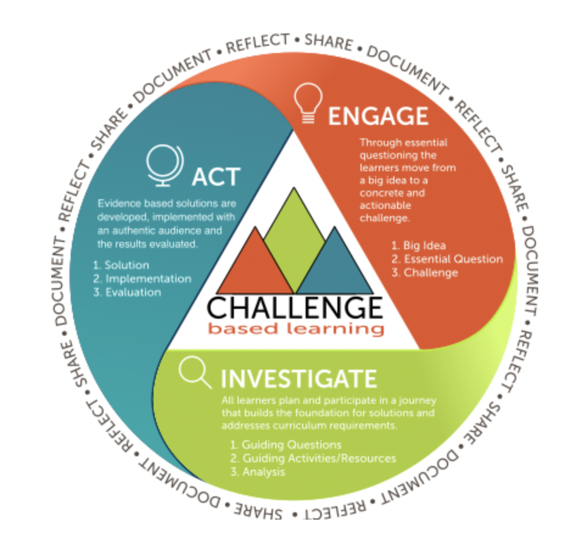
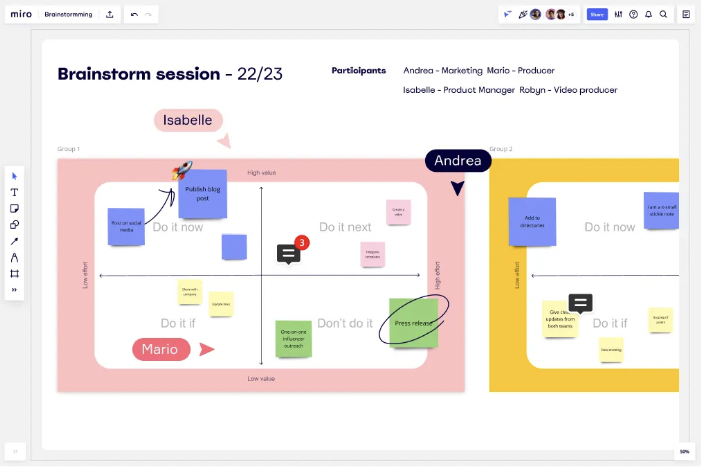

## 🍎 아카데미 생활

> (2023..03.13 ~ 2023.03.17)

</br>
</br>

Mini challenge1, MC1이 시작되었습니다. </br>

지나고 기록하려고 하니깐 뭐 어떻게 어디서부터 해야되는지 모르겠습니다. 내일(Day6)부턴 매일매일 기록해보겠습니다. </br>

*(아 그리고 이건 원래 일상 기록하는 블로그 말툰데.. 여기다가 써도 될진 모르겠지만… 그냥 이렇게 하겠습니다...)* </br>

Prelude를 진행하는 동안 MC1을 얼마나 기다렸는지 모르겠습니다. </br>

매일 다양한 러너들을 만날 수 있어서 좋았기도 했지만, 빨리 팀이 만들어져 어딘가에 소속감을 느끼고 싶다는 마음이 커졌던 것 같습니다. </br>

-- </br>

**CBL (Challenged Based Learning)** 

</br>



</br>

생전 처음 듣는 학습 방법으로 프로젝트를 하고 있습니다. </br>

하나의 광범위한 주제에 관해 아이디어 **발산**과 **수렴**을 반복하며 문제에 대한 답을 찾아나가는 방식인 것 같습니다. </br>

사실 아직 잘 모르겠지만 멘토분들이 이번 MC1은 CBL학습에 적응하기 위한 단계라고 하셨으니, 하고 나면 익숙해질꺼라 믿습니다. </br>

협업 툴은 Miro(미로)를 사용합니다. 사실 저는 이것도 처음 써봅니다. ‘이것도’라기엔 거의 전부 다 처음입니다. </br>

개인적인 생각으로는 Miro가 여럿이서 함께 브레인스토밍 하기에 좋은 툴 인 것 같습니다. </br>

</br>



</br>
</br>

이런식으로 사용하고 있는데, 15일동안의 과정이 하나의 선처럼 가로로 길게 뻗어 있어서 이것보다 좀 많이 깁니다.</br>

지금까지의 활동을 같은 화면에서 확인할 수 있어서 편리한 것 같습니다. </br>

</br>
</br>

## 🍎 회고


## 🍏 오늘 하루 한 줄 평

3월 20일 (월) </br>

> 유저들이 우리 서비스를 이용할 것이라는 가정 하에 solution에 대한 아이디어를 발산하고 있었습니다. </br>
> 유저가 없다면 플랫폼의 영향력조차 없어지는 상황에 대한 고려를 할 수 있게 되었습니다. </br>

</br>

3월 21일 (화) </br>

> 팀프로젝트를 더 효율적으로 할 수 있는 방법에 대한 고민 </br>
> 각자 파트를 나눠서 하는게 최선일까? </br>

</br>

3월 22일 (수) </br>

> 발표를 하기 전의 긴장됨과 떨림을 줄이고 싶습니다ㅜㅜㅜ 발표 잘하고 싶습니다.</br>
> 아직 여러모로 부족한게 너무 많다고 느꼈습니다.  </br>

</br>

3월 23일 (목) </br>

> 아직 CBL에 대한 정확한 이해가 부족한 것 같습니다. </br>
> 우리 팀의 활동이 올바른 방향으로 가고 있다는 것에 자신이 없어졌습니다. </br>

</br>

3월 24일 (금) </br>

> 어제의 고민 덕분에 오늘 CBL활동을 최대한 제대로 해보고 싶다는 생각이 들어 최대한 메뉴얼을 따라보려고 노력했습니다. </br>
> 고민에 대한 해답까지는 아니더라도 다른 날들에 비해 활동에 대한 만족도가 높았습니다. </br>


</br>
</br> 

```toc
```