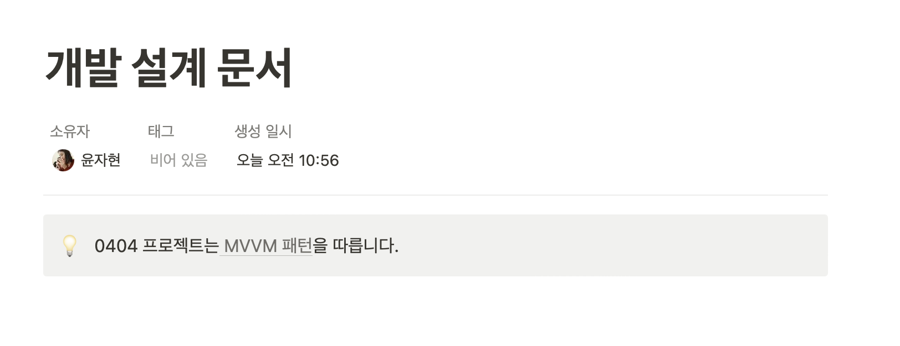
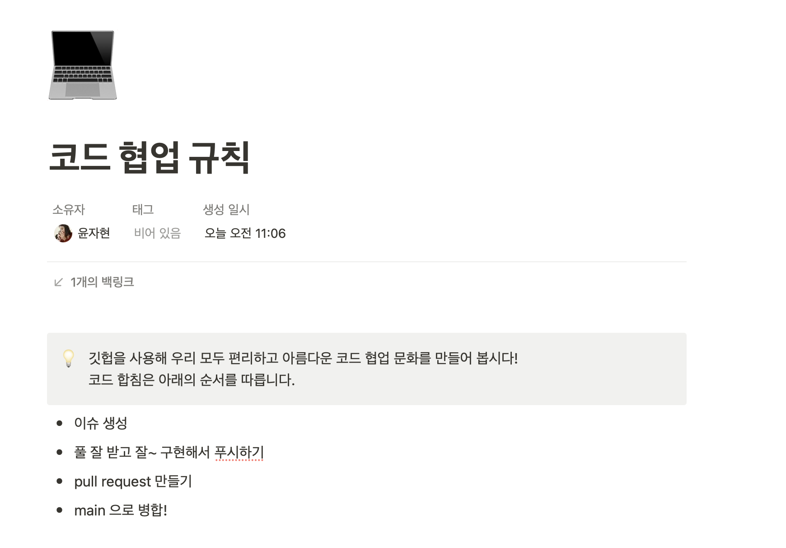
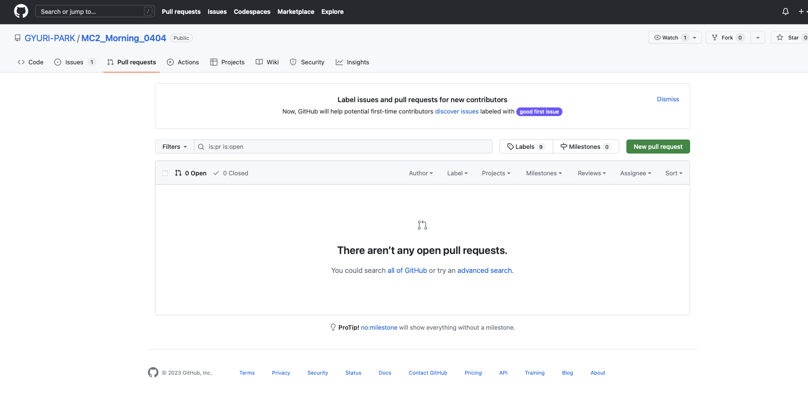
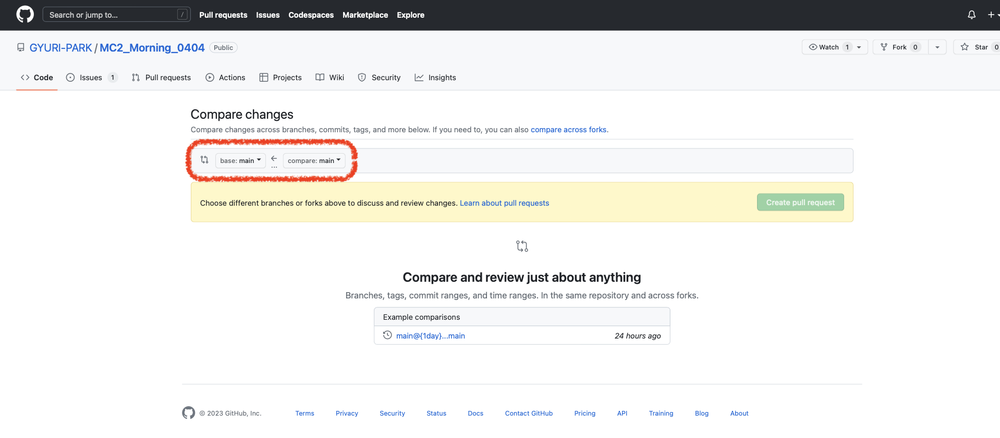

## 서론

오랜만에 씁니다. </br>
그렇게 귀찮았던 블로그 회고를 쓰게 하다니 ! </br>
그만큼 오늘 세션은 저에게 엄청난 설렘과 의미? 를 가져다 주었습니다 ! </br>
</br>

그동안 회고록을 작성하지 않았던 건 아닙니다. </br>
팀에서 공동 회고록을 작성하고 있는데, 언젠간 ? 아마도 (바라건대) 머지 않아 여기다가 정리해서 올릴 생각입니다. </br>

</br>

그래서 오늘 무엇을 했냐면 ? </br>

* 개발 설계 문서
* 팀내 코드 협업 규칙

을 만들었습니다 ! </br>
이걸 쓰고 있는 지금도 두근두근🩶 하군뇨 ! </br>

</br>

## 본론

### 📝 개발 설계 문서 

> 사실 이건 아직 작성 중입니다. </br>

</br>

지금까지 정해진 건 이번 MC2 프로젝트는 **MVVM 패턴**을 따른다는 것 ! 입니다 </br>



</br>

일단 넘어가겠습니다. </br>

</br>

### 💻 코드 협업 규칙

> 0404팀은 다음과 같은 사이클을 통해 협업합니다. </br>



</br>

다음은 토의를 통해 정한 팀내 협업 규칙입니다. </br>

#### 1. 이슈 생성 

> 💡 </br>
> 사전에 협의 하에 분할된 기능과 분업을 받은 사람이 깃허브에서 Issue 를 만듭니다. </br>
> Issue의 목적은 작업의 시작 알림 , 본인의 작업 진도율 확인입니다. </br>

</br>

* 이슈 만들기 


Issue 에 포함될 내용은 
` 구현할 기능의 한줄 요약, 
구현할 내용,
피그마에서 관련된 뷰 또는 다이어그램에서 기능 관계 캡쳐, 
예상 마감 시간` 등을 줄 글로 작성합니다.

</br>

* 이슈 닫기 

이슈에 생성된 #Num은 커밋 메시지에 포함하고 깃에서 해당 기능이 push 한 후 pull request를 생성합니다. </br>
생성된 pull request에서 이슈를 닫습니다. 


</br>

#### 2. Git 코드 Pull & Push

> 💡 </br>
> 깃허브에서는 기능 별로 브랜치를 파 pull 과 push 를 합니다. </br>
> 브랜치는 rebase 방식으로 합칩니다. </br>
> 브랜치명 예시 feature/uploadImage, GUI/uploadImage </br>

</br>

rebase 방식에 대해선 더 공부해봐야 될 것 같습니다. </br>

```bash
# 새로운 브랜치를 파서 작업을 시작합니다. 
git branch "브랜치명"
# 브랜치를 바꿔줍니다.
git checkout "브랜치명" 
# main branch에서 rebase 로 최신 코드를 받아옵니다.
git pull --rebase origin main

# conflict 를 해결하고 코드를 이어 작성합니다. 작성이 완료되면 원격저장소에 추가합니다. 
git add .
git commit -m "커밋메시지"
# 새로 작성한 브랜치를 원격저장소에 커밋합니다.
git push origin "브랜치명"
# 이후 깃헙 페이지에서 pull request 를 보내 Main 에 병합하는 과정을 거칩니다. 
```

</br>
</br>

* 커밋 메시지 컨벤션

> 💡 </br>
> 커밋 메시지는 아래의 태그를 참고해 업로드합니다. </br>
> 커밋 메시지는 깃헙 페이지에 업로드 될 때 표시되는 메시지입니다. </br>

</br>

```bash
# example git commit message
git commit -m "[FEAT][#12] 유저간 연결 기능 개발"
```

</br>
</br>

* 커밋 메시지 태그

- FEAT: 새로운 기능 추가, 삭제
- FIX: 버그, 오타 수정
- REFACTOR: 코드 리팩토링
- DOCS: 코드 외 문서 수정
- STYLE: 코드 포맷팅, 에셋 추가
- TEST: 테스트 코드
- CHORE: SPM, gitignore, 빌드 관련 등

</br>
</br>

#### 3. Pull Request

> 💡 </br>
> Pull Request는 main 브랜치의 코드를 온전히 보존하면서 구현이 완료된 코드를 main 브랜치에 병합하기 위해 필요합니다. </br>

</br>
 
다음은 **0404팀**의 **Pull Request 규칙** 입니다 </br>

* 자신이 작성한 기능과 연관된 코드가 있을 경우 그 코드 작성자에게 pull request를 할 때 관련된 Reviewer 를 지정합니다.
* 연관된 기능이 없을 경우 카카오톡 단톡방에 pull request 를 알리고 리뷰어를 한 명 이상 지정해 다른 개발자에게 승인받아 main 으로 병합합니다. 

</br>

**Pull Request 날리기**

> 풀리퀘스트 탭에서 New pull request 를 클릭합니다. </br>



</br>

> base 는 합쳐지는 원격 저장소의 브랜치, compare는 새로 업로드한 나의 브랜치입니다. </br>
> 브랜치를 지정하고 create pull request 를 눌러 풀리퀘를 생성합니다. </br>



</br>
</br>


## 결론

협업 경험이 전무한 저로선 오늘과 같은 활동이 처음입니다. </br>

MC1의 활동을 하면서 어떻게 하면 Github를 잘 활용할 수 있을지, </br>

협업의 장점을 최대화 하며 효율적이고, 정확한 협업을 할 수 있을까에 대해 고민했었습니다. </br>

그래서 오늘과 같은 활동의 필요성을 잘 알고 있었고, 처음은 늘 그렇듯 설렜습니다. </br>

이번 프로젝트를 정말 ! 잘 ! 제대로 ! 해보고 싶었는데 </br>

그 시작이 오늘이었고, 너무나도 만족스러운 시작인 것 같습니다 ! </br>

뿌듯 ! </br>


```toc
```
